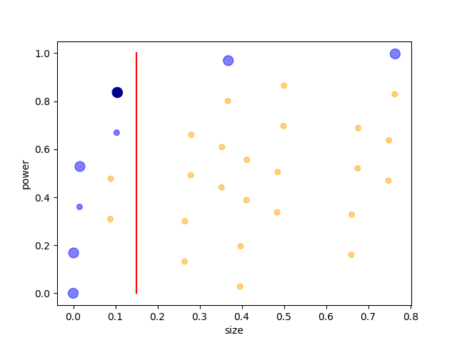

# README

The `neyman_pearson_tests` module provides functions to illustrate Neyman-Pearson tests, a common kind of test in statistics. The module is intended as a teaching tool. This README explains in tandem how the tests work and how to use the functions.

## Example

A florist ordered a large box of tulip bulbs. The box contains either 75% red-flowering and 25% yellow-flowering tulips, or 30% red-flowering and 70% yellow-flowering tulips. But he can't remember which. To find out, he plants 5 bulbs at random and counts how many produce red flowers. (The example is adapted from one in Howson and Urbach's *Scientific Reasoning: The Bayesian Aproach*, which is itself adapted from one in Kyburg's *Logical Foundations of Statistical Inference*.)

Here are the probabilities under the two hypotheses:

<center>
|         | 0    | 1    | 2    | 3    | 4    | 5    |
|---------|------|------|------|------|------|------|
| 75% red | .001 | .015 | .088 | .264 | .396 | .237 |
| 30% red | .168 | .360 | .309 | .132 | .028 | .002 |
</center>

What should the florist do after he observes the result?

## Neyman and Pearson's answer

Before the experiment, the florist should choose a *rejection region*: a set of outcomes. If, after the experiment, the outcome is in the rejection region, the florist should reject the first hypothesis (75% red) and accept the second (30% red); else, he should reject the second and accept the first.

But which rejection region to pick?

A rejection region's *size* is the probability of getting an outcome in the region, assuming the first hypothesis is true, and its *power* is the probability of getting an outcome in the region, assuming the second hypothesis is true. So our **first proposal** is: choose a region with low size and high power.

The function `plot_discrete_regions()` plots the size and power of every rejection region:

```
>>> from neyman_pearson_tests import *
>>> null = [.001, .015, .088, .264, .396]
>>> alt = [.168, .360, .309, .132, .028]
>>> plot_discrete_regions(null, alt)
>>> plt.show()
```

<p align="center">

</p>

(This function, and the plotting functions described later, return the `fig` and `ax` objects, to let you modify the plots if you want.)

Low size and high power pull in opposite directions. So the florist needs to trade them off. How?

Region 1 *dominates* Region 2 if it has lower size and higher power, with at least one inequality strict. This much is clear: the florist should choose an undominated region. The Neyman-Pearson Lemma says that rejection regions which take a special form&mdash;*likelihood ratio tests*&mdash;are undominated. So our **second proposal** is: choose a likelihood ratio test.

The function `plot_discrete_regions_plus()` shows which regions are undominated (blue blobs) and which regions are likelihood ratio tests (big blobs). 

```
>>> plot_discrete_regions_plus(null, alt)
>>> plt.show()
```

<p align="center">

</p>

Note that all big blobs are blue, by the Neyman-Pearson Lemma.

Still, there are multiple likelihood ratio tests. Can we give the florist more specific advice? This leads to the **third proposal**: choose a maximum acceptable size, then, among likelihood ratio tests of at most that size, choose the one with the highest power.

The function `plot_select_region()` shows the proposal in action:

```
>>> plot_select_region(null, alt, .15)
>>> plt.show()
```

<p align="center">

</p>

The red line is the maximum acceptable size. The black blob is the region selected according to the third proposal.

Instead of plotting the data, we can print it. The function `print_discrete_regions()` prints the size and power of each region and the function `print_discrete_regions_plus()` prints, in addition, which regions are dominated and which are likelihood ratio tests.

```
>>> print_discrete_regions_plus(null, alt)
region, size, power, dominated?, LRT?
() 0 0 False True
(0,) 0.001 0.168 False True
(1,) 0.015 0.36 False False
(2,) 0.088 0.309 True False
(3,) 0.264 0.132 True False
(4,) 0.396 0.028 True False
(0, 1) 0.016 0.528 False True
[the rest of the output is omitted]
``` 